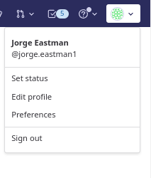
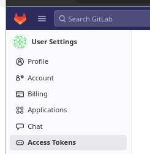
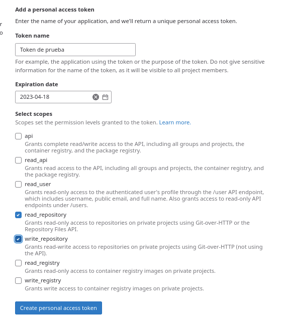
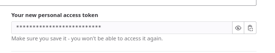

<image src="images/github-gitlab.jpeg" width="200px">


# Script para clonar repositorios utilizando token en vez de sshkey

Este es un script para clonar repositorios Git utilizando token en vez de sshkey.

Probado tanto con GitLab como con GitHub.

## Uso

Clonar este repositorio

```bash
git clone https://github.com/jeastman19/clone-script
```

Copiar env.example a .env

```bash
cp env.example .env
```

Editar .env con el token de gitlab

```bash
vi .env

# Agregar el token de gitlab a la variable TOKEN
# La variable USER puede conservar el valor por defecto
```

Ejecutar el script, al ejecutar el script, se le puede indicar uno o más repositorios a clonar

```bash
./clone <url del repositorio 1: https o git> [<url del repositorio n: https o git>]

```

## Global
Si deseamos tener acceso globar al script, podemos crear un enlace a /usr/local/bin

```bash
sudo ln $(pwd)/clone /usr/local/bin
```

Ahora podemos ejecutar el script desde cualquier directorio

```bash
clone <url del repositorio 1: https o git> [<url del repositorio n: https o git>]
```

## Creación del token en GitLab

#### Ingresar a GitLab


####Ir a Settings > Access Tokens
   


#### Asignar el nombre para el nuevo token y marcar los permisos


#### Hacer click en el botón "Create personal access token"


#### Copiar el token generado



Haciendo click en el botón "Copy to clipboard" se copia el token generado a la memoria del portapapeles

#### Pegar el token en el archivo .env

Por último, pegar el token generado en el archivo .env  en la variable TOKEN

